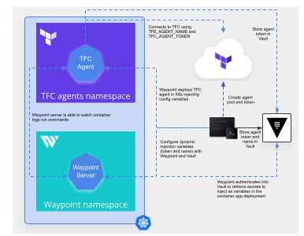
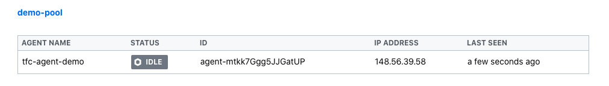
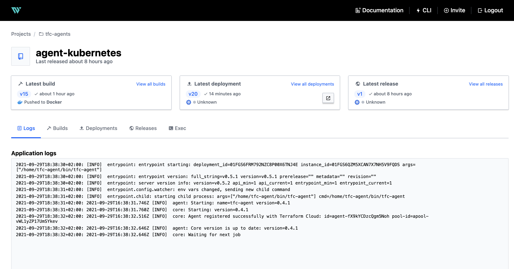

# Deploy TFC agents in Kubernetes with Waypoint

> NOTE: This is not an official HashiCorp repository and it is a WIP, so it might change frequently. The goal of this repository is to share knowledge.

## Why this...

You can deploy [Terraform Cloud agent docker container](https://hub.docker.com/r/hashicorp/tfc-agent) in Kubernetes just by a simple `kubectl apply -f <your_deploy_manifest>.yaml` command. But then you need to be aware about a couple of things:
* You need to inject a token variable in the container to authenticate to Terraform Cloud from the agent, so your deployment manifest needs to have the token variable definition (clear text or parametrized by some other Kubernetes templating tool like Helm, Kustomize or Kpt)
* When you deploy the agent, you need some Kubernetes knowledge and playground to do the debugging, like watching container logs or statuses
* Updating the agent means updating the manifest and redeploy again

There are some **security concerns** then about managing variables definitions in the Kubernetes manifest, and also some Kubernetes knowledge (not very advanced, but you need to have it) to do the agent monitoring.

So, I have decided to use a simple deployment tool like [Waypoint](https://www.waypointproject.io/) that helps on this by:
* Injecting the container variables without the need to define them on the manifest, so you can secure the process in different ways
* Watching container logs on the agent without having to access the Kubernetes cluster from your local machine
* To update your agent is as simple as running the following command: `waypoint up`

The goal of this repo is more a knowledge sharing thing about Waypoint deployments, but this use case could be a good example of securing your Terraform Cloud hosted agent deployments in Kubernetes to integrate in your CI/CD orchestration.

Following high level diagram explains the deployment:



## Requirements
* Waypoint [binary](https://www.waypointproject.io/downloads)
* Docker installed
* A Kubernetes cluster (I use [Minikube](https://kubernetes.io/docs/tutorials/kubernetes-basics/create-cluster/cluster-intro/) for a local test)
* [kubectl](https://kubernetes.io/docs/tasks/tools/install-kubectl/) tool
* [Terraform Cloud account](https://app.terraform.io/app) with a Business tier subscription
* A Terraform Cloud [organization token](https://www.terraform.io/docs/cloud/users-teams-organizations/api-tokens.html#organization-api-tokens)

## A secured happy path (using Vault to store Terraform Cloud agent pool token)

> NOTE: If you use this *happy path* you don't need to go to the other sections of this README. Avoid this and jump to the [next section](#create-an-agent-pool-token-in-terraform-cloud) if you want to do it by your own step by step. 

This section just guides you to run most of the preparation things in a script and uses your own [HashiCorp Vault](https://vaultproject.io) to store your Agent pool token. So, you will also need a Vault token with permissions to enable a K/V secrets engine called `waypoint` and privileges to read and write on it.

There is a Bash script `script.sh` included in this repo  that creates the agent pool token in Terraform Cloud using the REST API, connects to Vault to store the token and configures Waypoint variables with those values. So, you can do everything in your bash terminal by running the following commands in order (replace your variables values for Vault and Terraform Cloud):
```bash
export VAULT_ADDR=<your_vault_address>
export VAULT_TOKEN=<your_vault_token>
export TFE_TOKEN=<your_terraform_cloud_org_token>
export TFE_ORG=<your_terraform_org_name>

kubectl create ns waypoint

waypoint install -platform=kubernetes -namespace=waypoint -context-create="waypoint-kubernetes" -accept-tos

waypoint init

waypoint ui -authenticate

./script.sh

waypoint up -app agent-kubernetes
```

Then, you can access or execute any command in the container of the agent by using waypoint. For example, if you want to access to the container's terminal:
```bash
waypoint exec -app agent-kubernetes bash
```

And you can access to the containers logs (you can [use also de UI](#deploy-the-tfc-agent-with-waypoint)):
```bash
waypoint logs -app agent-kubernetes
```

## Create an agent pool token in Terraform Cloud

You need to edit or create an agent pool in Terraform Cloud and generate a pool token:

* Creating the agents pool with the API (edit your `TFE_TOKEN` and `TFE_ORG` environment variables with your **organization name** and **organization token** from Terraform Cloud):
```bash
TFC_POOL_ID=$(cat << EOF | curl -s -H "Authorization: Bearer $TFE_TOKEN" -H "Content-Type: application/vnd.api+json" -X POST -d @- https://app.terraform.io/api/v2/organizations/$TFE_ORG/agent-pools | jq -r '.data.id' 
{
  "data": {
    "type": "agent-pools",
    "attributes": {
      "name": "demo-pool"
    }
  }
}
EOF)
```
* Take the `id` of the previous output and use it to generate a token and save it in the `TFC_AGENT_TOKEN` environment variable:
```bash
TFC_AGENT_TOKEN=$(cat << EOF | curl -s -H "Authorization: Bearer $TFE_TOKEN" -H "Content-Type: application/vnd.api+json" -X POST -d @- https://app.terraform.io/api/v2/agent-pools/$TFC_POOL_ID/authentication-tokens | jq -r '.data.attributes.token'
{
  "data": {
    "type": "authentication-tokens",
    "attributes": {
      "description": "my-agent-token"
    }
  }
}
EOF)
```

## Install Waypoint and initialize the project

You can install Waypoint as a Docker container, in Kubernetes, using Nomad, or runnig standalone. Here, we are going to use the same Kubernetes cluster where we are deploying the TFC agent (we create a `waypoint` namespace to deploy):
```bash
kubectl create ns waypoint

waypoint install -platform=kubernetes -nasmespace=waypoint -context-create="tfc-kubernetes-context" -accept-tos
```

You can verify that you can connect to the Waypoint server:
```
$ waypoint context verify
✓ Context "tfc-kubernetes-context" connected successfully.
```

Now, from the root path of this repo (where the `waypoint.hcl` configuration file is located), run:
```bash
waypoint init
```

Connect to your Waypoint UI and check that you see a `tfc-agents` project:

```bash
waypoint ui -authenticate

```


## Deploy the TFC agent with Waypoint

Now it is time to deploy the Terraform Cloud agent. First set the `waypoint config` with the previous variables defined:

```bash
waypoint config set -app agent-kubernetes TFC_AGENT_TOKEN=$TFC_AGENT_TOKEN
waypoint config set -app agent-kubernetes TFC_AGENT_NAME="tfc-agent-demo"
```


```bash
waypoint up -app agent-kubernetes
```

That's all! You will see your TFC agent connected into the pool:



Also, you can check the agents logs from the Waypoint Project UI:


